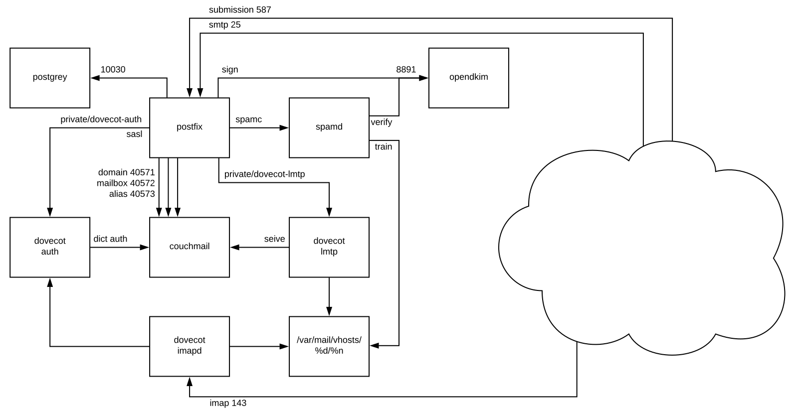

# Mail

A stack for deploying a personal mail system on kubernetes

## Why

I've ran my own mail server, for business and personal use, since before the days of gmail, and even hotmail.
I have since mostly stopped admining mail servers on the business side in deference to services like Google Apps for Business an Office 365.

However, I still run my personal mail on a dedicated stack.
I do this for a number of reasons, but security, privacy and flexibility are some of the top.
I particularly don't feel the cost asked of free users is equitable.

As deployment technology has progressed, my system was quietly humming along as a set of packages installed on a Gentoo server.

A monolithic stack like this begins to show its inertia, in the world of containers and orchestration, when attempting a change or move.
It make sense to modernize this now that you can get kubernetes at digital ocean,
and Google will give you a single-instance k8s cluster on even a free-tier machine.

This modernization project seemed a good opportunity to share my little project much more easily.
And because installing, running, and monitoring a mail system is still a PITA, and I want more normal people to run their own.

## Features

- SMTP Server (postfix)
- IMAP Server (dovecot)
- Preconfigured Strict Policies
- Virtual Domains
- Virtual Users
- Per-User Delivery Rules (dovecot pigeonhole sieves)
- Unified Datastore (couchmail)
- DKIM Signing (opendkim)
- Greylisting (postgrey)
- Envelope Validation and Spam Filtering (spamassasin)
- Spam Training
- Per-User Filtering Rules and Training Sets
- Per-User Spam Folder

This system features a central datastore where all user, domain, alias, and sieve scripts are stored.
A simple service called couchmail mediates between the services in the stack and the datastore.

This allows the simple hosting of any number of domains, and aliasing any email on one of those domains to any other address.

Dovecot plays a central role in mail delivery to clients and as a sasl authentication target for other services.
The Dovecot sasl service is configured to request user information from couchmail, so all services ultimately authenticate against the datastore.

Postfix plays a central role in receiving inbound mail and filtering it through policy, content, and spam filters.
It checks RBLs known relays and/or spammers and queries couchmail for realtime information on valid domains, users, aliases every time a message is received.

Postfix also hosts a client submission service for the delivery of outbound emails, authentication is handled via Dovecot's SASL service.

Spamassassin is used for processing inbound messages for spamminess and to validate the envelope of the email (DKIM, etc).
When a message is determined to be spam, it will be placed in the target user's Spam folder.

Every night Spamassassin is trained on ham from a user's Inbox and spam from their Spam folder, and stores a per-user fingerprint database for scoring future messages.
If the user catches ham in the Spam folder or spam in the Inbox, the user can move the message to the appropriate folder to update the training database.

## ToDo

- UI for managing domains/users/aliases
- Webmail (roundcube?)
- Letsencrypt
- Monitoring (prometheus, grafana)
- Helm?

## Implementation

We'll be using alpine docker containers running on a kubernetes cluster.

This repository contains the Dockerfiles for building each of the service containers, and all manifests required for deploying them onto a k8s cluster.
The images for each of the service containers will be hosted on (and built by) docker hub.

We will try to make all services run within a resource-constrained micro instance.
Some services may be optional (e.g. monitoring) in order to stay within this target footprint.

### Base Image

We're using Alpine Linux as our base OS image. The main reason is the small size and high-quality (and blazing fast) packaging system.

### Configuration

The default configuration should be enough for most mail handling systems of a reasonable size.
However, each of the pods will watch for custom config maps which can be used to override the default service configs.

When a config map for a service is changed, the pod will detect that and automatically reload or restart to effect the change.
